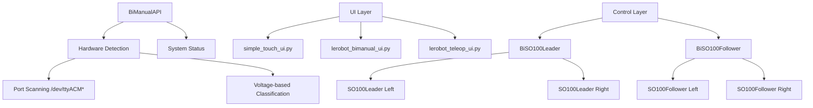
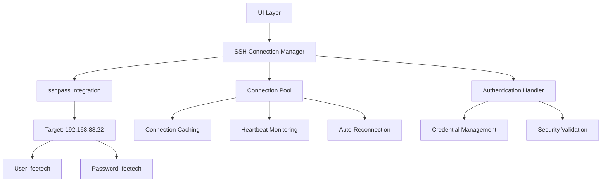
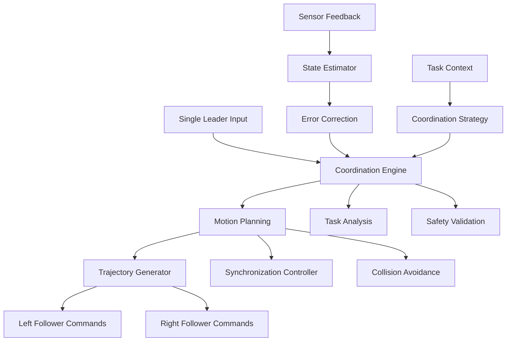

# Enhanced BiManual Control System - Technical Specification

## Executive Summary

This document specifies the enhanced bimanual robotics control architecture for the LeRobot system, integrating auto-login capabilities with advanced 1-leader-to-2-followers coordination while preserving all existing functionality.

**Key Enhancements:**
- **Auto-Login System**: Integrated sshpass-based remote access to Linux box (192.168.88.22)
- **Enhanced Coordination**: Advanced algorithms for 1-leader controlling 2-followers simultaneously
- **Preserved Compatibility**: All existing console and UI functionality maintained
- **Seamless Integration**: Unified system across all interface components

---

## 1. Current System Analysis

### 1.1 Existing Architecture Overview



### 1.2 Current Coordination Modes

#### 1.2.1 COORDINATED Mode
**Current Implementation:**
- Uses only left leader port for both arms
- Simple action mirroring: `{'left_arm': action, 'right_arm': action}`
- Located in [`simple_touch_ui.py:470-477`](simple_touch_ui.py:470-477)

**Limitations:**
- No sophisticated coordination algorithms
- Simple 1:1 mirroring without task awareness
- No relative positioning or synchronized movements

#### 1.2.2 INDEPENDENT Mode  
**Current Implementation:**
- Direct mapping: left leader → left follower, right leader → right follower
- Each leader operates independently
- Full dual-operator control

#### 1.2.3 MIRROR Mode
**Current Implementation:**
- Left leader controls both followers
- Right follower mirrors left movements
- Same as COORDINATED in current implementation

### 1.3 Key System Components

#### 1.3.1 BiManualAPI ([`bimanual_api.py`](bimanual_api.py))
- **Hardware Detection**: Scalable port detection (2, 4, 6, 8+ ports)
- **Voltage Classification**: Leader (<8V) vs Follower (>10V)
- **System Validation**: Import checking and readiness assessment

#### 1.3.2 BiSO100Leader ([`src/lerobot/teleoperators/bi_so100_leader/bi_so100_leader.py`](src/lerobot/teleoperators/bi_so100_leader/bi_so100_leader.py))
- **Dual Arm Control**: Manages left and right SO100Leader instances
- **Action Aggregation**: Combines actions with prefixed keys
- **Connection Management**: Handles connection/disconnection for both arms

#### 1.3.3 BiSO100Follower ([`src/lerobot/robots/bi_so100_follower/bi_so100_follower.py`](src/lerobot/robots/bi_so100_follower/bi_so100_follower.py))
- **Dual Arm Execution**: Manages left and right SO100Follower instances  
- **Action Distribution**: Routes prefixed actions to appropriate arms
- **Observation Aggregation**: Combines sensor data from both arms

---

## 2. Auto-Login System Design

### 2.1 Architecture Overview



### 2.2 Implementation Specifications

#### 2.2.1 SSH Connection Manager
**File:** `src/lerobot/remote/ssh_manager.py`

```python
class SSHConnectionManager:
    """Manages SSH connections with auto-login capabilities"""
    
    def __init__(self, host: str = "192.168.88.22", 
                 username: str = "feetech", 
                 password: str = "feetech"):
        self.host = host
        self.username = username  
        self.password = password
        self.connection_pool = {}
        self.heartbeat_interval = 30  # seconds
        
    async def connect(self, session_id: str = "default") -> bool:
        """Establish SSH connection using sshpass"""
        
    async def execute_command(self, command: str, session_id: str = "default") -> dict:
        """Execute remote command"""
        
    async def start_remote_control(self, mode: str, session_id: str = "default") -> bool:
        """Start remote bimanual control session"""
        
    def is_connected(self, session_id: str = "default") -> bool:
        """Check connection status"""
```

#### 2.2.2 sshpass Integration
**Requirements:**
- System dependency: `sudo apt-get install sshpass`
- Command format: `sshpass -p 'feetech' ssh feetech@192.168.88.22`

**Security Considerations:**
- Password stored in secure configuration
- Connection encryption via SSH
- Session timeout and auto-cleanup
- Failed attempt logging and throttling

#### 2.2.3 UI Integration Points

**Touch UI Integration (`simple_touch_ui.py`):**
```python
# Add remote connection button
remote_btn = tk.Button(
    exit_frame,
    text="🌐 REMOTE",
    font=('Arial', 16, 'bold'),
    bg='#8e44ad',
    fg='white',
    command=self.connect_remote
)

async def connect_remote(self):
    """Connect to remote Linux box"""
    self.ssh_manager = SSHConnectionManager()
    success = await self.ssh_manager.connect()
    if success:
        self.show_remote_control_options()
```

**Terminal UI Integration (`lerobot_teleop_ui.py`):**
```python
def remote_connection_menu():
    """Add remote connection option to main menu"""
    print("  8. 🌐 Connect to Remote Linux Box (192.168.88.22)")
```

### 2.3 Remote Command Execution

#### 2.3.1 Remote Control Session Commands
```bash
# Remote environment setup
ssh feetech@192.168.88.22 "cd ~/lerobot && source ~/miniconda3/bin/activate && conda activate lerobot"

# Remote bimanual control startup  
ssh feetech@192.168.88.22 "cd ~/lerobot && python simple_touch_ui.py --mode coordinated"

# Remote monitoring
ssh feetech@192.168.88.22 "cd ~/lerobot && python monitor_bimanual.py --live"
```

#### 2.3.2 Connection Health Monitoring
- **Heartbeat**: 30-second interval ping
- **Auto-Reconnect**: On connection loss
- **Timeout Handling**: 10-second command timeout
- **Error Recovery**: Graceful degradation to local mode

---

## 3. Enhanced 1-Leader-to-2-Followers Coordination

### 3.1 Advanced Coordination Architecture



### 3.2 Coordination Algorithms

#### 3.2.1 Enhanced Coordinated Mode
**File:** `src/lerobot/coordination/enhanced_coordinator.py`

```python
class EnhancedCoordinator:
    """Advanced coordination algorithms for 1-leader-to-2-followers control"""
    
    def __init__(self):
        self.coordination_mode = CoordinationMode.ENHANCED_COORDINATED
        self.task_context = None
        self.safety_monitor = SafetyMonitor()
        
    def compute_coordinated_actions(self, leader_action: dict, 
                                  task_context: str = "general") -> dict:
        """
        Compute sophisticated coordinated actions for both followers
        
        Args:
            leader_action: Single leader arm action
            task_context: Task type ("pick_place", "assembly", "transport", etc.)
        
        Returns:
            Dictionary with left and right follower actions
        """
        
        if task_context == "pick_place":
            return self._bimanual_pick_place(leader_action)
        elif task_context == "assembly":
            return self._coordinated_assembly(leader_action)
        elif task_context == "transport":
            return self._synchronized_transport(leader_action)
        else:
            return self._general_coordination(leader_action)
    
    def _bimanual_pick_place(self, leader_action: dict) -> dict:
        """Coordinated pick-and-place with approach/grasp/lift phases"""
        
    def _coordinated_assembly(self, leader_action: dict) -> dict:
        """Assembly tasks with one arm holding, other manipulating"""
        
    def _synchronized_transport(self, leader_action: dict) -> dict:
        """Synchronized movement for transporting objects"""
        
    def _general_coordination(self, leader_action: dict) -> dict:
        """General coordination with spatial relationships"""
        
class CoordinationStrategy:
    """Define coordination behaviors"""
    
    MIRROR = "mirror"                    # Simple mirroring (current)
    COMPLEMENTARY = "complementary"      # Arms perform complementary actions
    SYNCHRONIZED = "synchronized"       # Time-synchronized movements  
    RELATIVE = "relative"               # Maintain relative positioning
    TASK_AWARE = "task_aware"           # Context-dependent coordination
```

#### 3.2.2 Spatial Relationship Coordination

```python
class SpatialCoordinator:
    """Manages spatial relationships between coordinated arms"""
    
    def __init__(self):
        self.baseline_separation = 0.3  # meters between arms
        self.workspace_bounds = self._define_workspace()
        
    def maintain_relative_position(self, leader_pos: np.ndarray, 
                                 offset: np.ndarray = np.array([0.3, 0, 0])) -> np.ndarray:
        """Maintain fixed offset between arms"""
        
    def avoid_collision(self, left_target: np.ndarray, 
                       right_target: np.ndarray) -> tuple:
        """Ensure arms don't collide during coordinated movement"""
        
    def optimize_workspace_usage(self, leader_action: dict) -> dict:
        """Optimize arm positions for workspace coverage"""
```

#### 3.2.3 Task-Aware Coordination

```python
class TaskAwareCoordinator:
    """Context-sensitive coordination based on task requirements"""
    
    def __init__(self):
        self.task_database = {
            "pick_place": PickPlaceStrategy(),
            "assembly": AssemblyStrategy(), 
            "packaging": PackagingStrategy(),
            "sorting": SortingStrategy()
        }
        
    def detect_task_context(self, leader_trajectory: list) -> str:
        """Automatically detect task type from leader movements"""
        
    def adapt_coordination(self, task_type: str, leader_action: dict) -> dict:
        """Adapt coordination strategy based on detected task"""
```

### 3.3 Safety and Validation

#### 3.3.1 Coordination Safety Monitor
```python
class CoordinationSafetyMonitor:
    """Safety monitoring for coordinated bimanual operations"""
    
    def __init__(self):
        self.collision_detector = CollisionDetector()
        self.workspace_validator = WorkspaceValidator()
        self.force_monitor = ForceMonitor()
        
    def validate_coordinated_action(self, left_action: dict, 
                                  right_action: dict) -> tuple:
        """Validate coordinated actions for safety"""
        
    def emergency_stop_coordination(self) -> None:
        """Emergency stop for coordinated operations"""
```

---

## 4. Integration Points and Compatibility

### 4.1 UI Component Integration

#### 4.1.1 Touch UI Integration (`simple_touch_ui.py`)

**Enhanced Control Loop:**
```python
def _enhanced_coordinated_control(self):
    """Enhanced coordinated control with advanced algorithms"""
    try:
        # Initialize enhanced coordinator
        self.coordinator = EnhancedCoordinator()
        
        # Task context selection UI
        task_context = self.select_task_context()
        
        # Enhanced control loop
        while self.teleoperation_active:
            leader_action = self.teleop.get_action()
            
            # Apply enhanced coordination
            coordinated_actions = self.coordinator.compute_coordinated_actions(
                leader_action, task_context
            )
            
            # Safety validation
            if self.coordinator.safety_monitor.validate_actions(coordinated_actions):
                self.robot.send_action(coordinated_actions)
            else:
                self.emergency_stop()
                
def select_task_context(self) -> str:
    """UI for selecting coordination task context"""
    # Add task selection buttons to UI
    tasks = ["general", "pick_place", "assembly", "transport"]
    # Return selected task
```

**Remote Connection Integration:**
```python
def setup_remote_controls(self):
    """Add remote connection controls to touch UI"""
    
    # Remote connection status indicator
    self.remote_status = tk.Label(
        self.status_frame,
        text="🔴 Remote: Disconnected",
        font=('Arial', 12),
        bg='black', fg='red'
    )
    
    # Remote connection button
    self.remote_btn = tk.Button(
        self.button_frame,
        text="🌐 CONNECT REMOTE",
        command=self.toggle_remote_connection
    )
```

#### 4.1.2 Terminal UI Integration (`lerobot_teleop_ui.py`)

**Enhanced Menu Structure:**
```python
def enhanced_bimanual_menu():
    """Enhanced bimanual menu with coordination options"""
    print("  🤖🤖 ENHANCED BIMANUAL CONTROL")
    print("  1. 🚀 Quick Start (Auto-detect)")
    print("  2. 🎯 Task-Specific Coordination")
    print("  3. 🌐 Remote Connection (192.168.88.22)")
    print("  4. ⚙️  Advanced Coordination Settings")
    print("  5. 🔧 Calibration & Setup")
```

**Coordination Mode Selection:**
```python
def select_enhanced_coordination():
    """Enhanced coordination mode selection"""
    modes = {
        "1": ("ENHANCED_COORDINATED", "Advanced 1-leader-to-2-followers"),
        "2": ("TASK_AWARE", "Context-sensitive coordination"),
        "3": ("SPATIAL_RELATIVE", "Maintain spatial relationships"),
        "4": ("SYNCHRONIZED", "Time-synchronized movements")
    }
```

#### 4.1.3 BiManual API Integration (`bimanual_api.py`)

**Enhanced API Methods:**
```python
class EnhancedBiManualAPI(BiManualAPI):
    """Enhanced API with coordination and remote capabilities"""
    
    def __init__(self):
        super().__init__()
        self.ssh_manager = SSHConnectionManager()
        self.coordinator = EnhancedCoordinator()
        
    def get_enhanced_system_status(self):
        """Enhanced system status including remote capabilities"""
        status = super().get_system_status()
        status['remote_available'] = self.check_remote_availability()
        status['coordination_algorithms'] = self.get_available_algorithms()
        return status
        
    def check_remote_availability(self) -> bool:
        """Check if remote Linux box is accessible"""
        
    def get_available_algorithms(self) -> list:
        """Get list of available coordination algorithms"""
```

### 4.2 Feetech Motor Compatibility

#### 4.2.1 Motor Communication Enhancements
**Enhanced Motor Bus:** 
```python
class EnhancedFeetechMotorsBus(FeetechMotorsBus):
    """Enhanced motor bus with coordination support"""
    
    def __init__(self, *args, **kwargs):
        super().__init__(*args, **kwargs)
        self.coordination_mode = False
        self.sync_write_buffer = {}
        
    def enable_coordination_mode(self):
        """Enable coordinated motor control"""
        self.coordination_mode = True
        
    def coordinated_sync_write(self, left_commands: dict, right_commands: dict):
        """Synchronized write to coordinated motors"""
```

#### 4.2.2 Safety Integration
**Motor Safety for Coordination:**
```python
class CoordinatedMotorSafety(MotorSafetyMonitor):
    """Safety monitoring for coordinated motor operations"""
    
    def __init__(self, left_bus, right_bus):
        self.left_safety = MotorSafetyMonitor(left_bus)
        self.right_safety = MotorSafetyMonitor(right_bus)
        
    def monitor_coordinated_operation(self):
        """Monitor both arms during coordinated operation"""
        
    def coordinated_emergency_stop(self):
        """Emergency stop for both coordinated arms"""
```

---

## 5. Implementation Plan

### 5.1 Phase 1: Auto-Login System (Week 1-2)

#### 5.1.1 Core SSH Infrastructure
- [ ] Implement `SSHConnectionManager` class
- [ ] Add sshpass dependency and installation 
- [ ] Create connection pooling and heartbeat monitoring
- [ ] Add security validation and error handling

#### 5.1.2 UI Integration
- [ ] Add remote connection buttons to touch UI
- [ ] Integrate remote options in terminal UI
- [ ] Add connection status indicators
- [ ] Implement remote command execution

#### 5.1.3 Testing and Validation
- [ ] Unit tests for SSH connection manager
- [ ] Integration tests with target Linux box
- [ ] UI/UX testing for remote features
- [ ] Security testing and validation

### 5.2 Phase 2: Enhanced Coordination (Week 3-4)

#### 5.2.1 Coordination Engine
- [ ] Implement `EnhancedCoordinator` class
- [ ] Add spatial relationship algorithms
- [ ] Create task-aware coordination strategies
- [ ] Implement safety monitoring for coordination

#### 5.2.2 Algorithm Implementation
- [ ] Bimanual pick-and-place coordination
- [ ] Assembly task coordination
- [ ] Synchronized transport algorithms
- [ ] General coordination with collision avoidance

#### 5.2.3 UI Integration
- [ ] Add task context selection to touch UI
- [ ] Enhanced coordination mode in terminal UI
- [ ] Real-time coordination parameter adjustment
- [ ] Coordination performance monitoring

### 5.3 Phase 3: Integration and Testing (Week 5-6)

#### 5.3.1 System Integration
- [ ] Integrate auto-login with coordination systems
- [ ] Remote coordination control capabilities
- [ ] End-to-end testing of enhanced system
- [ ] Performance optimization and tuning

#### 5.3.2 Compatibility Validation
- [ ] Ensure existing functionality preservation
- [ ] Validate feetech motor compatibility
- [ ] Test with existing calibration systems
- [ ] Verify UI component compatibility

#### 5.3.3 Documentation and Deployment
- [ ] Update user manuals and guides
- [ ] Create deployment scripts and procedures
- [ ] Training materials for enhanced features
- [ ] System monitoring and maintenance procedures

---

## 6. Technical Requirements

### 6.1 Software Dependencies

#### 6.1.1 New Dependencies
```bash
# SSH and remote access
sudo apt-get install sshpass openssh-client

# Enhanced coordination algorithms
pip install numpy scipy scikit-learn

# Async support for remote operations
pip install asyncio aiohttp websockets
```

#### 6.1.2 Python Packages
```python
# requirements_enhanced.txt
sshpass-wrapper>=1.0.0
asyncio>=3.4.3
aiohttp>=3.8.0
numpy>=1.21.0
scipy>=1.7.0
scikit-learn>=1.0.0
```

### 6.2 Hardware Requirements

#### 6.2.1 Network Configuration
- **Target System**: Linux box at 192.168.88.22
- **Network Access**: SSH port 22 accessible
- **Credentials**: Username `feetech`, Password `feetech`
- **Bandwidth**: Minimum 1 Mbps for remote control

#### 6.2.2 Motor System Compatibility
- **Feetech Motors**: STS3215, STS3250, SMS series
- **Communication**: USB/Serial interface
- **Voltage Requirements**: Leader (<8V), Follower (>10V)
- **Port Configuration**: 4-port setup for bimanual operation

### 6.3 Performance Specifications

#### 6.3.1 Control Loop Performance
- **Local Control**: 100Hz target frequency
- **Remote Control**: 50Hz minimum frequency  
- **Coordination Latency**: <10ms processing time
- **Safety Response**: <5ms emergency stop

#### 6.3.2 Connection Reliability
- **SSH Connection**: 99% uptime target
- **Auto-Reconnect**: <5 second recovery time
- **Heartbeat Monitoring**: 30-second intervals
- **Error Recovery**: Graceful degradation to local mode

---

## 7. Security Considerations

### 7.1 SSH Security

#### 7.1.1 Authentication Security
- **Password Protection**: Secure storage of credentials
- **Connection Encryption**: SSH tunnel for all communications
- **Session Management**: Automatic timeout and cleanup
- **Access Logging**: Complete audit trail of remote connections

#### 7.1.2 Network Security
- **IP Restrictions**: Limited to specific target IP (192.168.88.22)
- **Port Restrictions**: SSH port 22 only
- **Firewall Rules**: Restrict outbound SSH connections
- **VPN Support**: Optional VPN integration for enhanced security

### 7.2 Motor Safety

#### 7.2.1 Coordination Safety
- **Collision Detection**: Real-time arm collision prevention
- **Workspace Limits**: Enforced operational boundaries
- **Emergency Stop**: Immediate halt of all coordinated operations
- **Force Limiting**: Maximum force/torque thresholds

#### 7.2.2 Remote Operation Safety
- **Connection Monitoring**: Continuous health checks
- **Failsafe Mode**: Automatic local fallback on connection loss
- **Command Validation**: Sanity checks for remote commands
- **Operator Override**: Local emergency stop always available

---

## 8. Monitoring and Diagnostics

### 8.1 System Monitoring

#### 8.1.1 Remote Connection Monitoring
```python
class RemoteConnectionMonitor:
    """Monitor remote SSH connections"""
    
    def __init__(self):
        self.connection_status = {}
        self.performance_metrics = {}
        
    def log_connection_event(self, event_type: str, details: dict):
        """Log connection events for diagnostics"""
        
    def get_connection_statistics(self) -> dict:
        """Get connection performance statistics"""
```

#### 8.1.2 Coordination Performance Monitoring
```python
class CoordinationMonitor:
    """Monitor coordination algorithm performance"""
    
    def __init__(self):
        self.algorithm_metrics = {}
        self.safety_events = []
        
    def track_coordination_performance(self, algorithm: str, metrics: dict):
        """Track coordination algorithm performance"""
        
    def log_safety_event(self, event_type: str, severity: str, details: dict):
        """Log safety events during coordination"""
```

### 8.2 Diagnostic Tools

#### 8.2.1 Connection Diagnostics
```bash
# Remote connection test
python -c "from ssh_manager import SSHConnectionManager; mgr = SSHConnectionManager(); print(mgr.test_connection())"

# Network latency test
ping -c 10 192.168.88.22

# SSH connectivity test
sshpass -p 'feetech' ssh -o ConnectTimeout=5 feetech@192.168.88.22 'echo "Connection OK"'
```

#### 8.2.2 Coordination Diagnostics
```python
# Coordination algorithm test
python test_coordination.py --algorithm enhanced_coordinated --duration 60

# Safety system validation
python validate_safety.py --coordination-mode --emergency-stop-test

# Performance benchmarking
python benchmark_coordination.py --compare-algorithms --generate-report
```

---

## 9. Conclusion

This enhanced bimanual control system provides:

1. **Seamless Auto-Login**: Integrated sshpass-based remote access to Linux systems
2. **Advanced Coordination**: Sophisticated 1-leader-to-2-followers algorithms with task awareness
3. **Preserved Compatibility**: All existing functionality maintained and enhanced
4. **Comprehensive Integration**: Unified system across touch UI, terminal UI, and API layers

The design ensures robust, safe, and efficient bimanual robot control while adding powerful remote capabilities and advanced coordination algorithms. The modular architecture allows for future extensions and customizations while maintaining backward compatibility with existing systems.

### Key Benefits:
- **Enhanced Productivity**: Advanced coordination algorithms improve task efficiency
- **Remote Accessibility**: Seamless remote control and monitoring capabilities  
- **Safety First**: Comprehensive safety monitoring and emergency procedures
- **Future-Proof**: Extensible architecture for additional algorithms and features
- **User-Friendly**: Intuitive interfaces across all interaction modalities

The implementation plan provides a structured approach to deployment with clear milestones and testing procedures, ensuring a smooth transition to the enhanced system.