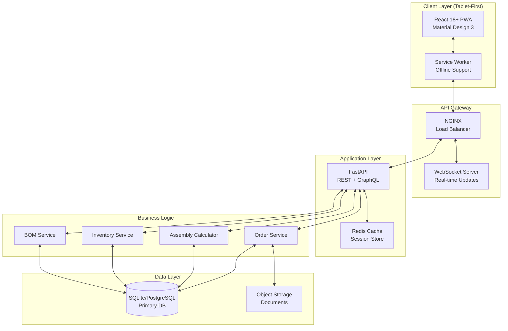
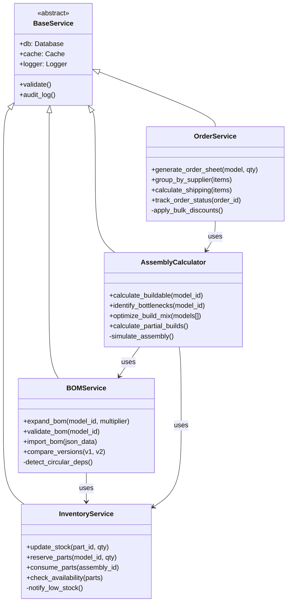
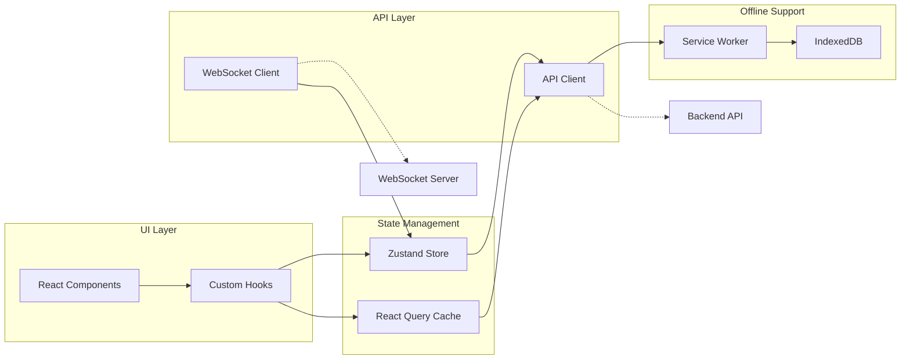

# BOM Calculator - System Architecture & Modern UI Design

## 1. System Architecture Overview

### High-Level Architecture



### Technology Stack

| Layer | Technology | Purpose |
|-------|------------|---------|
| **Frontend** | React 18, TypeScript 5 | Core UI framework |
| **UI Library** | Material-UI v5 (MUI) | Modern component library |
| **State Management** | Zustand + React Query | Simple state + server cache |
| **Styling** | Emotion + CSS Modules | Component styling |
| **Charts** | Recharts + D3.js | Data visualization |
| **Backend** | FastAPI 0.100+ | Async REST API |
| **Database** | SQLite → PostgreSQL | Data persistence |
| **Cache** | Redis | Session & API cache |
| **WebSocket** | Socket.io | Real-time updates |
| **Deployment** | Docker + K8s | Container orchestration |

## 2. Backend Architecture

### 2.1 FastAPI Application Structure

```
backend/
├── app/
│   ├── __init__.py
│   ├── main.py                 # FastAPI app entry
│   ├── config.py               # Environment config
│   ├── dependencies.py         # Dependency injection
│   │
│   ├── api/
│   │   ├── v1/
│   │   │   ├── endpoints/
│   │   │   │   ├── inventory.py
│   │   │   │   ├── assembly.py
│   │   │   │   ├── orders.py
│   │   │   │   └── bom.py
│   │   │   └── router.py
│   │   └── websocket.py       # WebSocket handlers
│   │
│   ├── core/
│   │   ├── security.py        # JWT, OAuth2
│   │   ├── database.py        # DB connection
│   │   └── cache.py           # Redis client
│   │
│   ├── models/
│   │   ├── domain/            # Domain models
│   │   ├── schemas/           # Pydantic schemas
│   │   └── database/          # SQLAlchemy models
│   │
│   ├── services/
│   │   ├── bom_service.py
│   │   ├── inventory_service.py
│   │   ├── assembly_calculator.py
│   │   └── order_service.py
│   │
│   └── utils/
│       ├── validators.py
│       └── formatters.py
│
├── migrations/                 # Alembic migrations
├── tests/
└── requirements.txt
```

### 2.2 Service Layer Architecture



### 2.3 API Endpoint Design

```yaml
openapi: 3.0.0
info:
  title: BOM Calculator API
  version: 1.0.0

paths:
  /api/v1/inventory:
    get:
      summary: Get all inventory items
      parameters:
        - name: category
          in: query
          schema:
            type: string
        - name: low_stock
          in: query
          schema:
            type: boolean
      responses:
        200:
          content:
            application/json:
              schema:
                type: array
                items:
                  $ref: '#/components/schemas/InventoryItem'
    
    patch:
      summary: Bulk update inventory
      requestBody:
        content:
          application/json:
            schema:
              type: array
              items:
                $ref: '#/components/schemas/InventoryUpdate'
  
  /api/v1/assembly/calculate/{model_id}:
    get:
      summary: Calculate buildable quantity
      parameters:
        - name: model_id
          in: path
          required: true
      responses:
        200:
          content:
            application/json:
              schema:
                $ref: '#/components/schemas/BuildableResult'
  
  /api/v1/orders/generate:
    post:
      summary: Generate order sheet
      requestBody:
        content:
          application/json:
            schema:
              $ref: '#/components/schemas/OrderRequest'
      responses:
        201:
          content:
            application/json:
              schema:
                $ref: '#/components/schemas/OrderSheet'
```

### 2.4 WebSocket Events

```typescript
// Real-time event definitions
interface WebSocketEvents {
  // Server -> Client
  'inventory:updated': { partId: string; quantity: number; }
  'assembly:completed': { assemblyId: string; modelId: string; }
  'order:status_changed': { orderId: string; status: OrderStatus; }
  'stock:low_alert': { partId: string; current: number; reorderPoint: number; }
  
  // Client -> Server
  'inventory:subscribe': { partIds: string[]; }
  'assembly:track': { assemblyId: string; }
  'order:track': { orderId: string; }
}
```

## 3. Frontend Architecture - Modern Tablet UI

### 3.1 React Application Structure

```
frontend/
├── src/
│   ├── app/
│   │   ├── App.tsx
│   │   ├── Router.tsx
│   │   └── store.ts           # Zustand store
│   │
│   ├── features/
│   │   ├── inventory/
│   │   │   ├── components/
│   │   │   │   ├── InventoryGrid.tsx
│   │   │   │   ├── InventoryCard.tsx
│   │   │   │   └── QuickEditDialog.tsx
│   │   │   ├── hooks/
│   │   │   └── services/
│   │   │
│   │   ├── assembly/
│   │   │   ├── components/
│   │   │   │   ├── AssemblyDashboard.tsx
│   │   │   │   ├── BuildCapacityChart.tsx
│   │   │   │   └── BottleneckVisualizer.tsx
│   │   │   └── hooks/
│   │   │
│   │   └── orders/
│   │       ├── components/
│   │       └── hooks/
│   │
│   ├── shared/
│   │   ├── components/
│   │   │   ├── TouchInput/
│   │   │   ├── SwipeableList/
│   │   │   ├── DataGrid/
│   │   │   └── Charts/
│   │   ├── hooks/
│   │   └── utils/
│   │
│   └── styles/
│       ├── theme.ts            # MUI theme config
│       └── global.css
│
├── public/
└── package.json
```

### 3.2 Modern UI Component Specifications

#### 3.2.1 Design System - Material Design 3

```typescript
// theme.ts - Modern Material Design 3 Theme
import { createTheme } from '@mui/material/styles';

export const theme = createTheme({
  palette: {
    mode: 'light', // with dark mode support
    primary: {
      main: '#6750A4',     // Dynamic Purple
      light: '#EADDFF',
      dark: '#21005E',
      contrastText: '#FFFFFF',
    },
    secondary: {
      main: '#625B71',     // Neutral Purple
      light: '#E8DEF8',
      dark: '#1E192B',
    },
    error: {
      main: '#BA1A1A',
      light: '#FFDAD6',
    },
    success: {
      main: '#006E26',
      light: '#7FDB8A',
    },
    background: {
      default: '#FEF7FF',
      paper: '#FFFFFF',
      elevation1: '#F6EDFF',
      elevation2: '#EDDEFF',
      elevation3: '#E5D5FF',
    }
  },
  shape: {
    borderRadius: 16, // Large rounded corners
  },
  typography: {
    fontFamily: '"Roboto Flex", "Roboto", "Helvetica", "Arial", sans-serif',
    h1: {
      fontSize: '2.5rem',
      fontWeight: 400,
      lineHeight: 1.2,
    },
    h2: {
      fontSize: '2rem',
      fontWeight: 400,
      lineHeight: 1.3,
    },
    body1: {
      fontSize: '1rem',
      lineHeight: 1.5,
    },
  },
  components: {
    MuiButton: {
      styleOverrides: {
        root: {
          borderRadius: 20,
          textTransform: 'none',
          padding: '12px 24px',
          fontSize: '1rem',
          minHeight: 48, // Touch target
        },
      },
    },
    MuiFab: {
      styleOverrides: {
        root: {
          borderRadius: 18,
          boxShadow: '0px 4px 8px rgba(0,0,0,0.15)',
        },
      },
    },
    MuiCard: {
      styleOverrides: {
        root: {
          borderRadius: 24,
          boxShadow: '0px 2px 8px rgba(0,0,0,0.08)',
        },
      },
    },
  },
});
```

#### 3.2.2 Key UI Components

```typescript
// InventoryDashboard Component Specification
interface InventoryDashboardProps {
  layout: 'grid' | 'list';
  viewMode: 'compact' | 'detailed';
}

const InventoryDashboard: React.FC = () => {
  return (
    <Container maxWidth="xl">
      {/* Top Navigation Bar with Search */}
      <AppBar position="sticky" elevation={0}>
        <Toolbar sx={{ py: 2 }}>
          <SearchBar 
            fullWidth
            placeholder="Search parts..."
            startAdornment={<SearchIcon />}
            sx={{ 
              maxWidth: 600,
              borderRadius: 28,
              backgroundColor: 'background.elevation1'
            }}
          />
          <Box sx={{ flexGrow: 1 }} />
          <ToggleButtonGroup>
            <ToggleButton value="grid"><GridViewIcon /></ToggleButton>
            <ToggleButton value="list"><ListViewIcon /></ToggleButton>
          </ToggleButtonGroup>
        </Toolbar>
      </AppBar>

      {/* Filter Chips */}
      <Box sx={{ py: 2 }}>
        <Stack direction="row" spacing={1} sx={{ overflowX: 'auto' }}>
          <Chip label="All" color="primary" />
          <Chip label="Low Stock" icon={<WarningIcon />} />
          <Chip label="Servos" />
          <Chip label="Electronics" />
          <Chip label="Mechanical" />
        </Stack>
      </Box>

      {/* Inventory Stats Cards */}
      <Grid container spacing={3}>
        <Grid item xs={12} md={3}>
          <StatCard
            title="Total Parts"
            value={245}
            trend="+12"
            icon={<InventoryIcon />}
            color="primary"
          />
        </Grid>
        <Grid item xs={12} md={3}>
          <StatCard
            title="Low Stock"
            value={8}
            trend="-2"
            icon={<WarningIcon />}
            color="warning"
          />
        </Grid>
        <Grid item xs={12} md={3}>
          <StatCard
            title="Total Value"
            value="$12,450"
            trend="+$450"
            icon={<AttachMoneyIcon />}
            color="success"
          />
        </Grid>
        <Grid item xs={12} md={3}>
          <StatCard
            title="Categories"
            value={7}
            icon={<CategoryIcon />}
            color="info"
          />
        </Grid>
      </Grid>

      {/* Inventory Grid with Touch Optimization */}
      <Box sx={{ mt: 3 }}>
        <InventoryGrid />
      </Box>

      {/* Floating Action Button */}
      <Fab
        color="primary"
        size="large"
        sx={{
          position: 'fixed',
          bottom: 24,
          right: 24,
        }}
      >
        <AddIcon />
      </Fab>
    </Container>
  );
};
```

#### 3.2.3 Touch-Optimized Input Components

```typescript
// TouchNumberInput - Optimized for tablet input
interface TouchNumberInputProps {
  value: number;
  onChange: (value: number) => void;
  min?: number;
  max?: number;
  step?: number;
  label: string;
}

const TouchNumberInput: React.FC<TouchNumberInputProps> = ({
  value, onChange, min = 0, max = 9999, step = 1, label
}) => {
  const [isEditing, setIsEditing] = useState(false);
  
  return (
    <Paper 
      elevation={isEditing ? 8 : 2}
      sx={{ 
        p: 2, 
        borderRadius: 3,
        transition: 'all 0.3s ease',
        border: isEditing ? '2px solid' : 'none',
        borderColor: 'primary.main',
      }}
    >
      <Typography variant="caption" color="text.secondary">
        {label}
      </Typography>
      
      <Stack direction="row" spacing={1} alignItems="center">
        <IconButton
          size="large"
          color="primary"
          onClick={() => onChange(Math.max(min, value - step * 10))}
          sx={{ 
            backgroundColor: 'primary.light',
            '&:active': { transform: 'scale(0.95)' }
          }}
        >
          <RemoveIcon />
        </IconButton>
        
        <IconButton
          size="large"
          onClick={() => onChange(Math.max(min, value - step))}
          sx={{ '&:active': { transform: 'scale(0.95)' }}
        >
          <RemoveCircleOutlineIcon />
        </IconButton>
        
        <TextField
          value={value}
          type="number"
          inputProps={{ 
            min, max, 
            style: { textAlign: 'center', fontSize: '1.5rem' }
          }}
          sx={{ 
            width: 120,
            '& .MuiOutlinedInput-root': {
              borderRadius: 3,
            }
          }}
          onFocus={() => setIsEditing(true)}
          onBlur={() => setIsEditing(false)}
          onChange={(e) => onChange(Number(e.target.value))}
        />
        
        <IconButton
          size="large"
          onClick={() => onChange(Math.min(max, value + step))}
          sx={{ '&:active': { transform: 'scale(0.95)' }}
        >
          <AddCircleOutlineIcon />
        </IconButton>
        
        <IconButton
          size="large"
          color="primary"
          onClick={() => onChange(Math.min(max, value + step * 10))}
          sx={{ 
            backgroundColor: 'primary.light',
            '&:active': { transform: 'scale(0.95)' }
          }}
        >
          <AddIcon />
        </IconButton>
      </Stack>
      
      {/* Quick preset buttons */}
      <Stack direction="row" spacing={1} sx={{ mt: 2 }}>
        {[0, 10, 25, 50, 100].map(preset => (
          <Chip
            key={preset}
            label={preset}
            onClick={() => onChange(preset)}
            color={value === preset ? 'primary' : 'default'}
            sx={{ minWidth: 48 }}
          />
        ))}
      </Stack>
    </Paper>
  );
};
```

#### 3.2.4 Assembly Capacity Visualization

```typescript
// BuildCapacityChart - Visual bottleneck analysis
const BuildCapacityChart: React.FC<{ modelId: string }> = ({ modelId }) => {
  const { data, loading } = useBuildCapacity(modelId);
  
  return (
    <Card sx={{ height: '100%', borderRadius: 4 }}>
      <CardContent>
        <Typography variant="h6" gutterBottom>
          Assembly Capacity Analysis
        </Typography>
        
        {/* Radial Progress Chart */}
        <Box sx={{ position: 'relative', height: 300 }}>
          <ResponsiveContainer>
            <RadialBarChart 
              cx="50%" 
              cy="50%" 
              innerRadius="30%" 
              outerRadius="90%"
              data={data?.capacityData}
            >
              <RadialBar
                minAngle={15}
                label={{ position: 'insideStart', fill: '#fff' }}
                background
                clockWise
                dataKey="available"
                fill="url(#gradientCapacity)"
              />
              <Tooltip />
            </RadialBarChart>
          </ResponsiveContainer>
          
          {/* Center Metric */}
          <Box
            sx={{
              position: 'absolute',
              top: '50%',
              left: '50%',
              transform: 'translate(-50%, -50%)',
              textAlign: 'center',
            }}
          >
            <Typography variant="h2" color="primary">
              {data?.maxBuildable || 0}
            </Typography>
            <Typography variant="body2" color="text.secondary">
              Units Available
            </Typography>
          </Box>
        </Box>
        
        {/* Bottleneck Parts List */}
        <Box sx={{ mt: 3 }}>
          <Typography variant="subtitle2" gutterBottom>
            Limiting Parts
          </Typography>
          <Stack spacing={1}>
            {data?.bottlenecks.map(part => (
              <Paper key={part.id} elevation={0} sx={{ p: 2, borderRadius: 2 }}>
                <Stack direction="row" justifyContent="space-between">
                  <Box>
                    <Typography variant="body2">{part.name}</Typography>
                    <LinearProgress
                      variant="determinate"
                      value={(part.available / part.required) * 100}
                      sx={{ mt: 1, height: 8, borderRadius: 4 }}
                    />
                  </Box>
                  <Chip
                    size="small"
                    label={`${part.available}/${part.required}`}
                    color={part.available >= part.required ? 'success' : 'error'}
                  />
                </Stack>
              </Paper>
            ))}
          </Stack>
        </Box>
      </CardContent>
    </Card>
  );
};
```

### 3.3 State Management Architecture

```typescript
// Zustand Store Architecture
interface BOMCalculatorStore {
  // Inventory State
  inventory: Map<string, InventoryItem>;
  inventoryFilter: InventoryFilter;
  inventorySort: SortConfig;
  
  // Assembly State
  buildableResults: Map<string, BuildableResult>;
  selectedModels: Set<string>;
  assemblyTargets: Map<string, number>;
  
  // Order State
  orders: Order[];
  currentOrderDraft: OrderDraft | null;
  
  // UI State
  theme: 'light' | 'dark';
  sidebarOpen: boolean;
  activeTab: TabName;
  
  // Actions
  actions: {
    // Inventory
    updateInventory: (partId: string, quantity: number) => void;
    bulkUpdateInventory: (updates: InventoryUpdate[]) => void;
    setInventoryFilter: (filter: InventoryFilter) => void;
    
    // Assembly
    calculateBuildable: (modelId: string) => Promise<void>;
    optimizeBuildMix: (models: string[]) => Promise<void>;
    
    // Orders
    generateOrderSheet: (params: OrderParams) => Promise<Order>;
    saveOrderDraft: (draft: OrderDraft) => void;
    
    // UI
    setTheme: (theme: 'light' | 'dark') => void;
    toggleSidebar: () => void;
  };
}
```

### 3.4 Data Flow Architecture



## 4. Deployment Architecture

### 4.1 Container Architecture

```yaml
# docker-compose.yml
version: '3.8'

services:
  nginx:
    image: nginx:alpine
    ports:
      - "80:80"
      - "443:443"
    volumes:
      - ./nginx.conf:/etc/nginx/nginx.conf
      - ./ssl:/etc/nginx/ssl
    depends_on:
      - api
      - frontend

  frontend:
    build:
      context: ./frontend
      dockerfile: Dockerfile
    environment:
      - REACT_APP_API_URL=${API_URL}
      - REACT_APP_WS_URL=${WS_URL}
    volumes:
      - frontend_build:/app/build

  api:
    build:
      context: ./backend
      dockerfile: Dockerfile
    environment:
      - DATABASE_URL=${DATABASE_URL}
      - REDIS_URL=${REDIS_URL}
      - SECRET_KEY=${SECRET_KEY}
    ports:
      - "8000:8000"
    depends_on:
      - db
      - redis
    volumes:
      - ./data:/app/data

  db:
    image: postgres:15-alpine
    environment:
      - POSTGRES_DB=bom_calculator
      - POSTGRES_USER=${DB_USER}
      - POSTGRES_PASSWORD=${DB_PASSWORD}
    volumes:
      - postgres_data:/var/lib/postgresql/data
    ports:
      - "5432:5432"

  redis:
    image: redis:7-alpine
    ports:
      - "6379:6379"
    volumes:
      - redis_data:/data

volumes:
  frontend_build:
  postgres_data:
  redis_data:
```

### 4.2 Kubernetes Deployment

```yaml
# k8s-deployment.yaml
apiVersion: apps/v1
kind: Deployment
metadata:
  name: bom-calculator-api
spec:
  replicas: 3
  selector:
    matchLabels:
      app: bom-calculator-api
  template:
    metadata:
      labels:
        app: bom-calculator-api
    spec:
      containers:
      - name: api
        image: bom-calculator-api:latest
        ports:
        - containerPort: 8000
        env:
        - name: DATABASE_URL
          valueFrom:
            secretKeyRef:
              name: db-secret
              key: url
        resources:
          requests:
            memory: "256Mi"
            cpu: "250m"
          limits:
            memory: "512Mi"
            cpu: "500m"
        livenessProbe:
          httpGet:
            path: /health
            port: 8000
          initialDelaySeconds: 30
          periodSeconds: 10
        readinessProbe:
          httpGet:
            path: /ready
            port: 8000
          initialDelaySeconds: 5
          periodSeconds: 5
---
apiVersion: v1
kind: Service
metadata:
  name: bom-calculator-api-service
spec:
  selector:
    app: bom-calculator-api
  ports:
    - protocol: TCP
      port: 80
      targetPort: 8000
  type: LoadBalancer
```

## 5. Performance Optimization Strategies

### 5.1 Frontend Optimization

```typescript
// Lazy Loading & Code Splitting
const InventoryModule = lazy(() => import('./features/inventory'));
const AssemblyModule = lazy(() => import('./features/assembly'));
const OrdersModule = lazy(() => import('./features/orders'));

// Virtual Scrolling for Large Lists
import { VariableSizeList } from 'react-window';

const InventoryList = ({ items }) => (
  <AutoSizer>
    {({ height, width }) => (
      <VariableSizeList
        height={height}
        width={width}
        itemCount={items.length}
        itemSize={getItemSize}
        overscanCount={5}
      >
        {({ index, style }) => (
          <InventoryRow 
            style={style} 
            item={items[index]} 
          />
        )}
      </VariableSizeList>
    )}
  </AutoSizer>
);

// Optimistic Updates
const useOptimisticUpdate = () => {
  const queryClient = useQueryClient();
  
  return useMutation({
    mutationFn: updateInventory,
    onMutate: async (newData) => {
      await queryClient.cancelQueries(['inventory']);
      const previousData = queryClient.getQueryData(['inventory']);
      
      queryClient.setQueryData(['inventory'], old => ({
        ...old,
        ...newData
      }));
      
      return { previousData };
    },
    onError: (err, newData, context) => {
      queryClient.setQueryData(['inventory'], context.previousData);
    },
    onSettled: () => {
      queryClient.invalidateQueries(['inventory']);
    },
  });
};
```

### 5.2 Backend Optimization

```python
# Caching Strategy
from fastapi_cache import FastAPICache
from fastapi_cache.decorator import cache
from fastapi_cache.backends.redis import RedisBackend

@router.get("/assembly/calculate/{model_id}")
@cache(expire=300)  # Cache for 5 minutes
async def calculate_buildable(
    model_id: str,
    db: Database = Depends(get_db),
    calculator: AssemblyCalculator = Depends(get_calculator)
):
    return await calculator.calculate_buildable_quantity(model_id)

# Database Query Optimization
from sqlalchemy.orm import selectinload, joinedload

async def get_bom_with_parts(model_id: str):
    return await db.query(BillOfMaterials)\
        .options(
            selectinload(BillOfMaterials.items)\
            .joinedload(BOMItem.part)
        )\
        .filter(BillOfMaterials.robot_model_id == model_id)\
        .first()

# Batch Processing
async def bulk_update_inventory(updates: List[InventoryUpdate]):
    async with db.begin():
        stmt = update(Inventory).where(
            Inventory.part_id == bindparam('part_id')
        ).values(quantity_loose=bindparam('quantity'))
        
        await db.execute_batch(stmt, updates)
```

## 6. Security Architecture

### 6.1 Authentication & Authorization

```python
# JWT Authentication with FastAPI
from fastapi_users import FastAPIUsers
from fastapi_users.authentication import JWTAuthentication

jwt_authentication = JWTAuthentication(
    secret=SECRET_KEY,
    lifetime_seconds=3600,
    tokenUrl="/auth/jwt/login"
)

fastapi_users = FastAPIUsers(
    get_user_manager,
    [jwt_authentication],
)

# Role-Based Access Control
class Role(enum.Enum):
    VIEWER = "viewer"
    TECHNICIAN = "technician"
    MANAGER = "manager"
    ADMIN = "admin"

def require_role(role: Role):
    def role_checker(current_user: User = Depends(current_active_user)):
        if current_user.role not in [role, Role.ADMIN]:
            raise HTTPException(
                status_code=403,
                detail="Insufficient permissions"
            )
        return current_user
    return role_checker

@router.post("/inventory/update")
async def update_inventory(
    update: InventoryUpdate,
    user: User = Depends(require_role(Role.TECHNICIAN))
):
    # Only technicians and above can update inventory
    pass
```

### 6.2 Data Security

```typescript
// Frontend Security Measures
// Content Security Policy
<meta http-equiv="Content-Security-Policy" 
      content="default-src 'self'; 
               script-src 'self' 'unsafe-inline'; 
               style-src 'self' 'unsafe-inline';
               img-src 'self' data: https:;
               connect-src 'self' wss://api.example.com">

// Input Sanitization
import DOMPurify from 'dompurify';

const sanitizeInput = (input: string): string => {
  return DOMPurify.sanitize(input, { 
    ALLOWED_TAGS: [],
    ALLOWED_ATTR: []
  });
};

// API Request Encryption
const secureApiClient = axios.create({
  baseURL: process.env.REACT_APP_API_URL,
  timeout: 10000,
  withCredentials: true,
  headers: {
    'X-Requested-With': 'XMLHttpRequest',
  },
});

secureApiClient.interceptors.request.use(
  config => {
    const token = getAuthToken();
    if (token) {
      config.headers.Authorization = `Bearer ${token}`;
    }
    return config;
  },
  error => Promise.reject(error)
);
```

## 7. Monitoring & Observability

### 7.1 Application Monitoring

```python
# Backend Monitoring with Prometheus
from prometheus_client import Counter, Histogram, generate_latest
from fastapi import Response

# Metrics
http_requests_total = Counter(
    'http_requests_total', 
    'Total HTTP requests', 
    ['method', 'endpoint', 'status']
)

http_request_duration = Histogram(
    'http_request_duration_seconds',
    'HTTP request duration',
    ['method', 'endpoint']
)

@app.middleware("http")
async def monitor_requests(request: Request, call_next):
    start_time = time.time()
    
    response = await call_next(request)
    
    duration = time.time() - start_time
    http_requests_total.labels(
        method=request.method,
        endpoint=request.url.path,
        status=response.status_code
    ).inc()
    
    http_request_duration.labels(
        method=request.method,
        endpoint=request.url.path
    ).observe(duration)
    
    return response

@app.get("/metrics")
async def metrics():
    return Response(
        content=generate_latest(),
        media_type="text/plain"
    )
```

### 7.2 Error Tracking

```typescript
// Frontend Error Boundary & Tracking
import * as Sentry from "@sentry/react";

Sentry.init({
  dsn: process.env.REACT_APP_SENTRY_DSN,
  integrations: [
    new Sentry.BrowserTracing(),
    new Sentry.Replay(),
  ],
  tracesSampleRate: 0.1,
  replaysSessionSampleRate: 0.1,
});

const ErrorBoundary: React.FC = ({ children }) => (
  <Sentry.ErrorBoundary
    fallback={({ error, resetError }) => (
      <ErrorFallback error={error} resetError={resetError} />
    )}
    showDialog
  >
    {children}
  </Sentry.ErrorBoundary>
);
```

## 8. Testing Strategy

### 8.1 Test Architecture

```
tests/
├── unit/
│   ├── backend/
│   │   ├── test_bom_service.py
│   │   ├── test_assembly_calculator.py
│   │   └── test_inventory_service.py
│   └── frontend/
│       ├── components/
│       └── hooks/
├── integration/
│   ├── test_api_endpoints.py
│   └── test_websocket_events.py
├── e2e/
│   ├── inventory.spec.ts
│   ├── assembly.spec.ts
│   └── orders.spec.ts
└── performance/
    ├── load_test.js
    └── stress_test.js
```

### 8.2 Testing Implementation

```python
# Backend Unit Test Example
import pytest
from services.assembly_calculator import AssemblyCalculator

@pytest.fixture
def calculator():
    return AssemblyCalculator(mock_db, mock_bom_service)

class TestAssemblyCalculator:
    @pytest.mark.asyncio
    async def test_calculate_buildable_with_sufficient_inventory(self, calculator):
        # Arrange
        model_id = "so-arm100"
        mock_inventory = create_mock_inventory(sufficient=True)
        
        # Act
        result = await calculator.calculate_buildable_quantity(model_id)
        
        # Assert
        assert result.max_quantity == 3
        assert len(result.limiting_parts) == 0
        assert result.status == "READY"
    
    @pytest.mark.asyncio
    async def test_identify_bottlenecks(self, calculator):
        # Arrange
        model_id = "lekiwi"
        mock_inventory = create_mock_inventory(
            shortages=["raspberry_pi_5", "omni_wheel"]
        )
        
        # Act
        bottlenecks = await calculator.identify_bottlenecks(model_id)
        
        # Assert
        assert len(bottlenecks) == 2
        assert "raspberry_pi_5" in [b.part_id for b in bottlenecks]
```

```typescript
// Frontend Component Test
import { render, screen, fireEvent, waitFor } from '@testing-library/react';
import userEvent from '@testing-library/user-event';
import { TouchNumberInput } from '../TouchNumberInput';

describe('TouchNumberInput', () => {
  it('should increment value when plus button clicked', async () => {
    const onChange = jest.fn();
    
    render(
      <TouchNumberInput
        value={5}
        onChange={onChange}
        min={0}
        max={100}
        label="Quantity"
      />
    );
    
    const incrementButton = screen.getByRole('button', { name: /add/i });
    await userEvent.click(incrementButton);
    
    expect(onChange).toHaveBeenCalledWith(6);
  });
  
  it('should respect max value constraint', async () => {
    const onChange = jest.fn();
    
    render(
      <TouchNumberInput
        value={99}
        onChange={onChange}
        max={100}
        label="Quantity"
      />
    );
    
    const incrementBy10Button = screen.getByRole('button', { name: /\+10/i });
    await userEvent.click(incrementBy10Button);
    
    expect(onChange).toHaveBeenCalledWith(100); // Not 109
  });
});
```

## 9. Migration Strategy

### 9.1 Database Migration Plan

```python
# Alembic Migration Example
"""add_inventory_tracking

Revision ID: 001
Create Date: 2024-01-01 10:00:00.000000

"""
from alembic import op
import sqlalchemy as sa

def upgrade():
    op.create_table(
        'inventory_audit',
        sa.Column('id', sa.Integer(), primary_key=True),
        sa.Column('part_id', sa.String(), nullable=False),
        sa.Column('change_quantity', sa.Integer(), nullable=False),
        sa.Column('reason', sa.String()),
        sa.Column('timestamp', sa.DateTime(), default=sa.func.now()),
        sa.Column('user_id', sa.String()),
    )
    
    op.create_index('idx_inventory_audit_part', 'inventory_audit', ['part_id'])
    op.create_index('idx_inventory_audit_timestamp', 'inventory_audit', ['timestamp'])

def downgrade():
    op.drop_table('inventory_audit')
```

## 10. Documentation & API Reference

### 10.1 API Documentation Structure

```yaml
# OpenAPI Documentation
info:
  title: BOM Calculator API
  description: |
    ## Overview
    RESTful API for robot parts inventory and assembly management.
    
    ## Authentication
    All endpoints require JWT authentication except `/auth/*`.
    
    ## Rate Limiting
    - 100 requests per minute for authenticated users
    - 10 requests per minute for unauthenticated users
    
  version: 1.0.0
  contact:
    email: support@bomcalculator.com
  license:
    name: MIT
    url: https://opensource.org/licenses/MIT

servers:
  - url: https://api.bomcalculator.com/v1
    description: Production server
  - url: https://staging-api.bomcalculator.com/v1
    description: Staging server
  - url: http://localhost:8000/v1
    description: Development server

tags:
  - name: inventory
    description: Inventory management operations
  - name: assembly
    description: Assembly calculation and planning
  - name: orders
    description: Order generation and tracking
  - name: bom
    description: Bill of Materials management
```

This comprehensive architecture document provides:
- Modern Material Design 3 UI specifications
- Scalable backend architecture with FastAPI
- Touch-optimized tablet components
- Real-time WebSocket integration
- Offline-first PWA capabilities
- Complete deployment and monitoring strategies
- Security best practices
- Testing and migration plans

The design emphasizes beautiful, modern UI patterns while maintaining robust backend architecture suitable for production deployment.