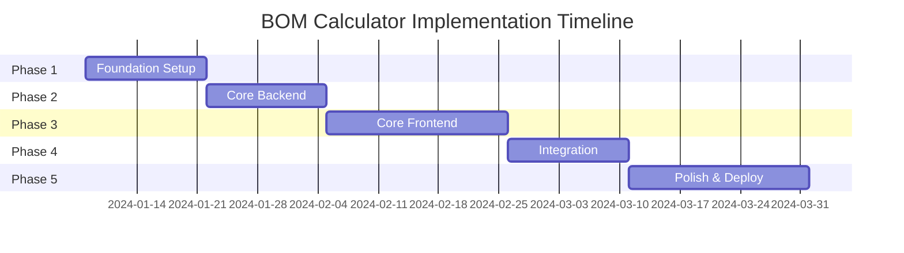

# BOM Calculator - Implementation Roadmap

## Executive Summary

This roadmap outlines the development of a modern, tablet-optimized BOM Calculator application for robot parts inventory management. The project will be delivered in 5 major phases over 12 weeks, with emphasis on beautiful UI design, robust backend architecture, and seamless tablet experience.

## Project Timeline Overview

## Phase 1: Foundation & Setup (Weeks 1-2)

### Week 1: Project Infrastructure

#### Backend Setup
- [ ] Initialize FastAPI project structure
- [ ] Setup Python virtual environment
- [ ] Configure development dependencies
- [ ] Setup SQLAlchemy ORM with Alembic migrations
- [ ] Configure Redis for caching
- [ ] Setup logging and configuration management
- [ ] Create Docker development environment
- [ ] Setup pre-commit hooks and linting

#### Frontend Setup
- [ ] Initialize React 18 + TypeScript project
- [ ] Configure Material-UI v5 with custom theme
- [ ] Setup Zustand for state management
- [ ] Configure React Query for server state
- [ ] Setup ESLint and Prettier
- [ ] Configure build tools (Vite/Webpack)
- [ ] Setup Storybook for component development

#### Database Design
- [ ] Create database schema
- [ ] Design indexes for performance
- [ ] Create initial migration scripts
- [ ] Setup seed data scripts

**Deliverables:**
- Working development environment
- CI/CD pipeline configuration
- Database schema implemented
- Project documentation

### Week 2: Design System Implementation

#### UI Foundation
- [ ] Implement Material Design 3 tokens
- [ ] Create color system with dark mode
- [ ] Setup typography scale
- [ ] Configure spacing and grid system
- [ ] Implement elevation system
- [ ] Create base layout components

#### Component Library Foundation
- [ ] Create component folder structure
- [ ] Implement ThemeProvider
- [ ] Create base Button components
- [ ] Create Card components
- [ ] Create Input components
- [ ] Setup component documentation

#### Testing Setup
- [ ] Configure Jest for unit testing
- [ ] Setup React Testing Library
- [ ] Configure Cypress for E2E testing
- [ ] Setup pytest for backend testing
- [ ] Create testing utilities

**Deliverables:**
- Complete design system
- Base component library
- Testing infrastructure
- Storybook with initial components

## Phase 2: Core Backend Development (Weeks 3-4)

### Week 3: Domain Logic & Services

#### Domain Models
- [ ] Implement Part model
- [ ] Implement RobotModel model
- [ ] Implement BillOfMaterials model
- [ ] Implement Inventory model
- [ ] Implement Assembly model
- [ ] Implement Order model
- [ ] Create Pydantic schemas

#### Core Services
- [ ] BOMService
  - [ ] expand_bom() method
  - [ ] validate_bom() method
  - [ ] import_bom_from_json() method
  - [ ] Circular dependency detection
  
- [ ] InventoryService
  - [ ] update_stock() method
  - [ ] reserve_parts() method
  - [ ] consume_parts() method
  - [ ] check_availability() method
  
- [ ] AssemblyCalculator
  - [ ] calculate_buildable_quantity() method
  - [ ] identify_bottlenecks() method
  - [ ] optimize_build_mix() method
  - [ ] calculate_partial_builds() method

**Deliverables:**
- Complete domain model implementation
- Core business logic services
- Unit tests for all services
- Service documentation

### Week 4: API Development

#### REST API Endpoints
- [ ] Authentication endpoints
  - [ ] POST /auth/login
  - [ ] POST /auth/logout
  - [ ] POST /auth/refresh
  
- [ ] Inventory endpoints
  - [ ] GET /api/v1/inventory
  - [ ] PATCH /api/v1/inventory
  - [ ] POST /api/v1/inventory/bulk-update
  
- [ ] Assembly endpoints
  - [ ] GET /api/v1/assembly/calculate/{model_id}
  - [ ] POST /api/v1/assembly/create
  - [ ] GET /api/v1/assembly/{id}
  
- [ ] Order endpoints
  - [ ] POST /api/v1/orders/generate
  - [ ] GET /api/v1/orders/{id}
  - [ ] GET /api/v1/orders
  
- [ ] BOM endpoints
  - [ ] GET /api/v1/bom/{model_id}
  - [ ] POST /api/v1/bom/import
  - [ ] PUT /api/v1/bom/{id}

#### WebSocket Implementation
- [ ] Setup Socket.io server
- [ ] Implement event handlers
- [ ] Create real-time notifications
- [ ] Implement connection management

#### API Features
- [ ] Request validation
- [ ] Error handling middleware
- [ ] Rate limiting
- [ ] API documentation (OpenAPI)
- [ ] CORS configuration

**Deliverables:**
- Complete REST API
- WebSocket server
- API documentation
- Integration tests

## Phase 3: Core Frontend Development (Weeks 5-7)

### Week 5: Core UI Components

#### Navigation Components
- [ ] AppBar with search
- [ ] Tab navigation
- [ ] Breadcrumb navigation
- [ ] Mobile drawer menu

#### Data Display Components
- [ ] InventoryCard component
- [ ] AssemblyCapacityCard component
- [ ] OrderCard component
- [ ] StatCard component
- [ ] DataTable component

#### Input Components
- [ ] TouchNumberInput component
- [ ] SearchBar component
- [ ] FilterChips component
- [ ] DatePicker component
- [ ] Autocomplete component

#### Feedback Components
- [ ] Loading states
- [ ] Error boundaries
- [ ] Toast notifications
- [ ] Confirmation dialogs
- [ ] Progress indicators

**Deliverables:**
- Complete component library
- Component unit tests
- Storybook documentation
- Accessibility compliance

### Week 6: Main Features Implementation

#### Inventory Management
- [ ] Inventory dashboard layout
- [ ] Grid/List view toggle
- [ ] Search and filter functionality
- [ ] Quick edit mode
- [ ] Bulk operations
- [ ] Export functionality

#### Assembly Calculator
- [ ] Assembly dashboard
- [ ] Model selection interface
- [ ] Buildable quantity display
- [ ] Bottleneck visualization
- [ ] Build optimizer
- [ ] Assembly wizard

#### Order Management
- [ ] Order generation form
- [ ] Order preview
- [ ] Supplier grouping
- [ ] Cost calculation
- [ ] Export options
- [ ] Order history

**Deliverables:**
- Three main feature modules
- Feature integration tests
- User flow documentation

### Week 7: State Management & Data Flow

#### State Management
- [ ] Setup Zustand stores
  - [ ] Inventory store
  - [ ] Assembly store
  - [ ] Order store
  - [ ] UI store
- [ ] Implement actions and selectors
- [ ] Setup persistence
- [ ] Implement middleware

#### API Integration
- [ ] Create API client service
- [ ] Setup React Query hooks
- [ ] Implement optimistic updates
- [ ] Error handling
- [ ] Retry logic
- [ ] Cache management

#### Real-time Features
- [ ] WebSocket client setup
- [ ] Event listeners
- [ ] Real-time state updates
- [ ] Connection management
- [ ] Reconnection logic

**Deliverables:**
- Complete state management
- API integration layer
- Real-time functionality
- Data flow documentation

## Phase 4: Integration & Testing (Weeks 8-9)

### Week 8: System Integration

#### Frontend-Backend Integration
- [ ] Connect all API endpoints
- [ ] Test data flow
- [ ] Implement error handling
- [ ] Optimize API calls
- [ ] Setup monitoring

#### Authentication & Authorization
- [ ] Implement JWT authentication
- [ ] Role-based access control
- [ ] Protected routes
- [ ] Session management
- [ ] Token refresh logic

#### Offline Capabilities
- [ ] Service Worker setup
- [ ] IndexedDB integration
- [ ] Offline queue implementation
- [ ] Sync mechanism
- [ ] Conflict resolution

**Deliverables:**
- Fully integrated application
- Authentication system
- Offline support
- Integration test suite

### Week 9: Testing & Quality Assurance

#### Testing Coverage
- [ ] Unit test coverage > 80%
- [ ] Integration test all APIs
- [ ] E2E test critical paths
- [ ] Performance testing
- [ ] Load testing
- [ ] Security testing

#### Bug Fixes & Optimization
- [ ] Fix identified bugs
- [ ] Performance optimization
- [ ] Memory leak detection
- [ ] Bundle size optimization
- [ ] Database query optimization

#### User Acceptance Testing
- [ ] Create UAT scenarios
- [ ] Conduct UAT sessions
- [ ] Gather feedback
- [ ] Prioritize fixes
- [ ] Implement critical changes

**Deliverables:**
- Complete test coverage
- Bug-free application
- Performance benchmarks
- UAT report

## Phase 5: Polish & Deployment (Weeks 10-12)

### Week 10: UI Polish & Accessibility

#### UI Enhancements
- [ ] Animation implementation
- [ ] Micro-interactions
- [ ] Loading state refinement
- [ ] Error state design
- [ ] Empty state design
- [ ] Dark mode refinement

#### Accessibility
- [ ] WCAG 2.1 AA compliance
- [ ] Screen reader testing
- [ ] Keyboard navigation
- [ ] Focus management
- [ ] ARIA labels
- [ ] Color contrast verification

#### Responsive Design
- [ ] Test on various tablets
- [ ] Orientation handling
- [ ] Touch gesture optimization
- [ ] Performance on different devices

**Deliverables:**
- Polished UI
- Accessibility compliance
- Device compatibility report

### Week 11: Documentation & Training

#### Technical Documentation
- [ ] API documentation
- [ ] Database documentation
- [ ] Architecture documentation
- [ ] Deployment guide
- [ ] Troubleshooting guide

#### User Documentation
- [ ] User manual
- [ ] Quick start guide
- [ ] Video tutorials
- [ ] FAQ section
- [ ] Tips and tricks

#### Developer Documentation
- [ ] Code documentation
- [ ] Contributing guide
- [ ] Development setup guide
- [ ] Testing guide
- [ ] Style guide

**Deliverables:**
- Complete documentation set
- Training materials
- Support resources

### Week 12: Deployment & Launch

#### Production Setup
- [ ] Configure production environment
- [ ] Setup SSL certificates
- [ ] Configure domain
- [ ] Setup CDN
- [ ] Configure backups

#### Deployment
- [ ] Database migration
- [ ] Deploy backend services
- [ ] Deploy frontend application
- [ ] Configure monitoring
- [ ] Setup logging

#### Launch Activities
- [ ] Final testing in production
- [ ] Performance monitoring
- [ ] User onboarding
- [ ] Support channel setup
- [ ] Launch announcement

**Deliverables:**
- Production deployment
- Monitoring dashboard
- Support infrastructure
- Launch materials

## Risk Management

### Technical Risks

| Risk | Impact | Probability | Mitigation |
|------|--------|-------------|------------|
| Performance issues with large inventories | High | Medium | Implement pagination, caching, virtual scrolling |
| Complex BOM circular dependencies | High | Low | Robust validation, depth limiting |
| Offline sync conflicts | Medium | Medium | Conflict resolution strategy, user notifications |
| Browser compatibility | Medium | Low | Progressive enhancement, polyfills |
| Scalability concerns | High | Low | Horizontal scaling, database optimization |

### Project Risks

| Risk | Impact | Probability | Mitigation |
|------|--------|-------------|------------|
| Scope creep | High | Medium | Clear requirements, change control process |
| Timeline delays | Medium | Medium | Buffer time, parallel development |
| Resource availability | High | Low | Cross-training, documentation |
| Third-party dependencies | Medium | Low | Vendor evaluation, fallback options |

## Success Metrics

### Technical Metrics
- Page load time < 2 seconds
- API response time < 200ms
- 99.5% uptime
- Zero critical security vulnerabilities
- Test coverage > 80%

### Business Metrics
- User adoption rate > 80%
- Task completion time reduced by 50%
- Error rate < 1%
- User satisfaction score > 4.5/5
- Support ticket volume < 5 per week

### Performance KPIs
- Inventory update time < 500ms
- Assembly calculation < 1 second
- Order generation < 2 seconds
- Concurrent users > 100
- Database query time < 100ms

## Resource Requirements

### Team Composition
- 1 Technical Lead
- 2 Backend Developers
- 2 Frontend Developers
- 1 UI/UX Designer
- 1 QA Engineer
- 1 DevOps Engineer
- 1 Project Manager

### Infrastructure
- Development environment (Docker)
- Staging environment (Cloud)
- Production environment (Cloud)
- CI/CD pipeline (GitHub Actions)
- Monitoring tools (Prometheus, Grafana)
- Error tracking (Sentry)

### Tools & Licenses
- Development tools (IDEs, Git)
- Design tools (Figma)
- Testing tools (Jest, Cypress)
- Project management (Jira)
- Communication (Slack)
- Documentation (Confluence)

## Post-Launch Plan

### Month 1
- Monitor system performance
- Gather user feedback
- Fix critical bugs
- Optimize based on usage patterns

### Month 2-3
- Implement feature requests
- Performance optimization
- Expand device support
- Additional integrations

### Month 4-6
- Major feature release
- API v2 planning
- Mobile app consideration
- Scale infrastructure

### Long-term (6+ months)
- Machine learning integration
- Predictive analytics
- Multi-tenant support
- Enterprise features
- International expansion

## Conclusion

This implementation roadmap provides a structured approach to building a modern, tablet-optimized BOM Calculator application. The phased approach ensures steady progress while maintaining flexibility for adjustments based on feedback and discoveries during development.

The emphasis on beautiful UI design, robust architecture, and comprehensive testing will result in a production-ready application that delights users while maintaining reliability and performance.

## Appendices

### A. Technology Stack Details
- Frontend: React 18.2+, TypeScript 5.0+, Material-UI 5.14+
- Backend: Python 3.11+, FastAPI 0.104+, SQLAlchemy 2.0+
- Database: PostgreSQL 15+ (production), SQLite (development)
- Cache: Redis 7.0+
- Deployment: Docker, Kubernetes
- Monitoring: Prometheus, Grafana, Sentry

### B. Development Standards
- Code style: ESLint, Prettier, Black
- Git workflow: GitFlow
- PR reviews: Required 2 approvals
- Testing: TDD/BDD approach
- Documentation: Inline code comments, README files

### C. Communication Plan
- Daily standups: 9:00 AM
- Sprint planning: Bi-weekly
- Sprint review: End of sprint
- Retrospectives: Monthly
- Stakeholder updates: Weekly

### D. Budget Estimation
- Development: $150,000 - $200,000
- Infrastructure: $500 - $1,000/month
- Tools & Licenses: $2,000 - $3,000
- Contingency: 20% of total
- Total: $180,000 - $250,000