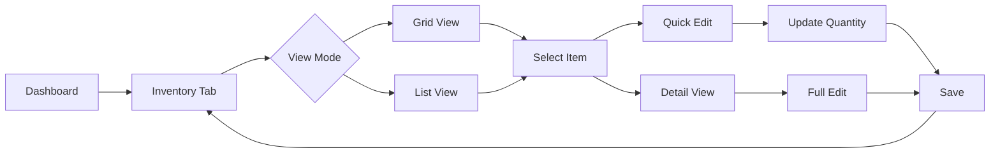
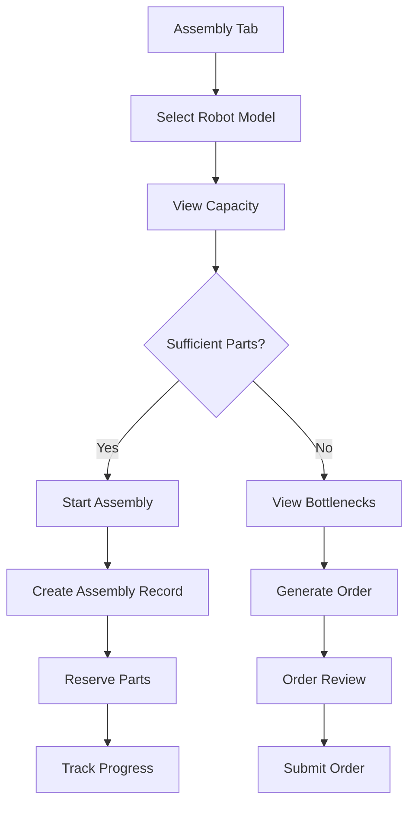

# BOM Calculator - UI/UX Design Specifications

## 1. Design Principles

### Core Principles
- **Touch-First**: All interactions optimized for 10-inch tablet
- **Visual Hierarchy**: Clear information architecture with progressive disclosure
- **Delightful Interactions**: Smooth animations and micro-interactions
- **Accessibility**: WCAG 2.1 AA compliant with high contrast support
- **Responsive**: Adapts from 768px to 1366px tablet widths

### Design Language
- **Material Design 3**: Latest Material You design system
- **Dynamic Color**: Adaptive color schemes based on brand
- **Elevated Surfaces**: Layered depth with subtle shadows
- **Rounded Corners**: Soft, approachable interface elements
- **Fluid Motion**: Physics-based animations

## 2. Visual Design System

### 2.1 Color Palette

```scss
// Primary - Dynamic Purple
$primary-50: #FEF7FF;
$primary-100: #F6EDFF;
$primary-200: #EDDEFF;
$primary-300: #E5D5FF;
$primary-400: #D0BCFF;
$primary-500: #B69DF8;  // Main
$primary-600: #9F82DB;
$primary-700: #8B6FC0;
$primary-800: #6750A4;  // Brand
$primary-900: #4A3D7B;

// Secondary - Neutral Tones
$secondary-50: #FAFAFA;
$secondary-100: #F5F5F5;
$secondary-200: #EEEEEE;
$secondary-300: #E0E0E0;
$secondary-400: #BDBDBD;
$secondary-500: #9E9E9E;
$secondary-600: #757575;
$secondary-700: #616161;
$secondary-800: #424242;
$secondary-900: #212121;

// Semantic Colors
$success: #198754;
$success-light: #D1F2EB;
$warning: #FFA726;
$warning-light: #FFF3CD;
$error: #DC3545;
$error-light: #F8D7DA;
$info: #0DCAF0;
$info-light: #CFF4FC;

// Surface Colors
$surface-1: #FFFFFF;
$surface-2: #FEF7FF;
$surface-3: #F6EDFF;
$surface-4: #EDDEFF;
$surface-5: #E5D5FF;

// Dark Mode
$dark-bg: #1C1B1F;
$dark-surface-1: #2B2930;
$dark-surface-2: #3E3D41;
$dark-surface-3: #515052;
$dark-surface-4: #636264;
$dark-surface-5: #757376;
```

### 2.2 Typography Scale

```scss
// Font Family
$font-primary: 'Roboto Flex', system-ui, -apple-system, sans-serif;
$font-mono: 'Roboto Mono', 'Courier New', monospace;

// Type Scale
$display-large: 57px;   // Line height: 64px
$display-medium: 45px;  // Line height: 52px
$display-small: 36px;   // Line height: 44px

$headline-large: 32px;  // Line height: 40px
$headline-medium: 28px; // Line height: 36px
$headline-small: 24px;  // Line height: 32px

$title-large: 22px;     // Line height: 28px
$title-medium: 16px;    // Line height: 24px, Weight: 500
$title-small: 14px;     // Line height: 20px, Weight: 500

$body-large: 16px;      // Line height: 24px
$body-medium: 14px;     // Line height: 20px
$body-small: 12px;      // Line height: 16px

$label-large: 14px;     // Line height: 20px, Weight: 500
$label-medium: 12px;    // Line height: 16px, Weight: 500
$label-small: 11px;     // Line height: 16px, Weight: 500
```

### 2.3 Spacing & Grid System

```scss
// Spacing Scale (8pt grid)
$space-xs: 4px;
$space-sm: 8px;
$space-md: 16px;
$space-lg: 24px;
$space-xl: 32px;
$space-2xl: 48px;
$space-3xl: 64px;

// Grid System
$grid-columns: 12;
$grid-gutter: 24px;
$grid-margin: 24px;

// Breakpoints (Tablet-focused)
$bp-small: 768px;   // iPad Mini
$bp-medium: 1024px; // iPad Pro 11"
$bp-large: 1366px;  // iPad Pro 12.9"

// Touch Targets
$touch-min: 48px;   // Minimum touch target
$touch-ideal: 56px; // Ideal touch target
$touch-large: 64px; // Large touch target
```

### 2.4 Elevation System

```scss
// Material Design 3 Elevation
$elevation-0: none;
$elevation-1: 0px 1px 2px rgba(0, 0, 0, 0.05);
$elevation-2: 0px 2px 4px rgba(0, 0, 0, 0.08);
$elevation-3: 0px 4px 8px rgba(0, 0, 0, 0.10);
$elevation-4: 0px 6px 12px rgba(0, 0, 0, 0.12);
$elevation-5: 0px 8px 16px rgba(0, 0, 0, 0.15);
```

## 3. Layout Patterns

### 3.1 Dashboard Layout

```
┌─────────────────────────────────────────────────────────┐
│  Navigation Bar                                         │
│  ┌────────────┬──────────────────┬────────┬──────────┐│
│  │ Logo       │ Search           │ Filter │ Profile  ││
│  └────────────┴──────────────────┴────────┴──────────┘│
├─────────────────────────────────────────────────────────┤
│  Tab Bar                                                │
│  ┌──────────┬──────────┬──────────┬──────────┐        │
│  │Inventory │Assembly  │Orders    │Settings  │        │
│  └──────────┴──────────┴──────────┴──────────┘        │
├─────────────────────────────────────────────────────────┤
│  Content Area                                           │
│  ┌─────────────────────────────────────────────────┐   │
│  │                                                 │   │
│  │  Stats Cards (Horizontal Scroll)                │   │
│  │  ┌──────┐ ┌──────┐ ┌──────┐ ┌──────┐         │   │
│  │  │      │ │      │ │      │ │      │         │   │
│  │  └──────┘ └──────┘ └──────┘ └──────┘         │   │
│  │                                                 │   │
│  │  Main Content Grid                             │   │
│  │  ┌──────────────┬──────────────┐              │   │
│  │  │              │              │              │   │
│  │  │   Card 1     │   Card 2     │              │   │
│  │  │              │              │              │   │
│  │  └──────────────┴──────────────┘              │   │
│  │                                                 │   │
│  └─────────────────────────────────────────────────┘   │
│                                                         │
│  Floating Action Button                  ⊕             │
└─────────────────────────────────────────────────────────┘
```

### 3.2 Split View Pattern (Landscape)

```
┌─────────────────────────────────────────────────────────┐
│  Navigation                                             │
├────────────────────────┬────────────────────────────────┤
│  Master List (40%)     │  Detail View (60%)            │
│                        │                                │
│  ┌──────────────────┐  │  ┌────────────────────────┐   │
│  │ Search           │  │  │ Item Details            │   │
│  └──────────────────┘  │  │                        │   │
│                        │  │ ┌────────────────────┐ │   │
│  ┌──────────────────┐  │  │ │                    │ │   │
│  │ Item 1 (Active)  │  │  │ │   Visual Chart     │ │   │
│  └──────────────────┘  │  │ │                    │ │   │
│  ┌──────────────────┐  │  │ └────────────────────┘ │   │
│  │ Item 2           │  │  │                        │   │
│  └──────────────────┘  │  │ Properties:            │   │
│  ┌──────────────────┐  │  │ • Property 1: Value    │   │
│  │ Item 3           │  │  │ • Property 2: Value    │   │
│  └──────────────────┘  │  │ • Property 3: Value    │   │
│                        │  │                        │   │
│                        │  │ [Action Button]        │   │
│                        │  └────────────────────────┘   │
└────────────────────────┴────────────────────────────────┘
```

## 4. Component Library

### 4.1 Navigation Components

#### Top Navigation Bar
```tsx
// Specifications
Height: 64px
Background: surface-1 with elevation-1
Padding: 0 24px
Position: sticky top

// Structure
<AppBar>
  <Logo size={40} />
  <SearchBar 
    width="fluid" 
    maxWidth={600}
    height={48}
    borderRadius={24}
  />
  <IconButton size={48}>
    <FilterIcon />
  </IconButton>
  <Avatar size={40} />
</AppBar>
```

#### Tab Navigation
```tsx
// Specifications
Height: 48px
Indicator: 3px bottom border
Active: primary-600
Inactive: secondary-600
Typography: label-large

// Interaction
- Swipe gesture to switch tabs
- Animated indicator movement
- Haptic feedback on selection
```

### 4.2 Card Components

#### Inventory Card (Grid View)
```
┌─────────────────────────────────┐
│  ┌─────┐  Part Name        ⋮   │ <- 48px header
│  │ IMG │  Category Badge        │
│  └─────┘                        │
├─────────────────────────────────┤
│  Quantity                       │ <- 64px content
│  ┌─────────────────────────┐    │
│  │ [−] [  125  ] [+]       │    │    Touch input
│  └─────────────────────────┘    │
├─────────────────────────────────┤
│  Status: ● In Stock             │ <- 32px footer
│  Reorder: 50 units              │
└─────────────────────────────────┘

Dimensions: 280x180px
Border Radius: 16px
Elevation: elevation-2
Padding: 16px
```

#### Assembly Capacity Card
```
┌─────────────────────────────────────┐
│  Robot Model Name                   │
│  ┌─────────────────────────────┐    │
│  │                             │    │
│  │      Radial Progress        │    │
│  │         ┌─────┐             │    │
│  │        │  12  │ Units       │    │
│  │         └─────┘             │    │
│  │                             │    │
│  └─────────────────────────────┘    │
│                                     │
│  Bottlenecks:                      │
│  ┌──────────┐ ┌──────────┐        │
│  │ Part 1   │ │ Part 2   │        │
│  └──────────┘ └──────────┘        │
│                                     │
│  [Start Assembly] [Order Parts]    │
└─────────────────────────────────────┘

Dimensions: 360x420px
Chart Height: 200px
Actions: Full width buttons
```

### 4.3 Input Components

#### Touch Number Stepper
```
┌─────────────────────────────────────┐
│  Label                              │
│  ┌────┬────┬──────────┬────┬────┐  │
│  │ −10│ −1 │   125    │ +1 │+10 │  │
│  └────┴────┴──────────┴────┴────┘  │
│  ┌────┬────┬────┬────┬────┐        │
│  │ 0  │ 10 │ 25 │ 50 │100 │ Presets│
│  └────┴────┴────┴────┴────┘        │
└─────────────────────────────────────┘

Button Size: 48x48px
Input Width: 120px
Preset Chips: 48x32px
Total Width: 360px
```

#### Search Bar
```
┌─────────────────────────────────────┐
│  🔍 Search parts...            ✕   │
└─────────────────────────────────────┘

Height: 48px
Border Radius: 24px
Padding: 0 16px
Background: surface-2
Focus: primary border
```

### 4.4 Data Visualization

#### Inventory Status Chart
```
┌─────────────────────────────────────┐
│  Inventory Distribution             │
│                                     │
│  ████████████████░░░░  75% In Stock│
│  ████████░░░░░░░░░░░░  40% Reserved│
│  ████░░░░░░░░░░░░░░░░  20% Low     │
│                                     │
│  Legend:                            │
│  ● In Stock  ● Reserved  ● Low     │
└─────────────────────────────────────┘

Type: Horizontal Bar Chart
Height: 200px
Bar Height: 32px
Spacing: 16px
```

#### Assembly Bottleneck Visualizer
```
┌─────────────────────────────────────┐
│  Part Requirements vs Available     │
│                                     │
│  Servo A    ████████████░░░ 80%    │
│  Servo B    ██████░░░░░░░░░ 40%    │
│  Board      ████████████████ 100%  │
│  Cable      ███░░░░░░░░░░░░ 25%    │
│                                     │
│  ⚠ 2 parts below requirements      │
└─────────────────────────────────────┘

Type: Progress Bar List
Bar Height: 24px
Colors: Green (>75%), Yellow (25-75%), Red (<25%)
```

## 5. Interaction Patterns

### 5.1 Gesture Support

```typescript
// Swipe Actions
interface SwipeGestures {
  swipeLeft: 'delete' | 'archive';
  swipeRight: 'edit' | 'favorite';
  swipeUp: 'expand';
  swipeDown: 'collapse' | 'refresh';
  pinch: 'zoom';
  longPress: 'contextMenu';
}

// Gesture Thresholds
const SWIPE_THRESHOLD = 75;  // pixels
const SWIPE_VELOCITY = 0.3;  // pixels/ms
const LONG_PRESS_DURATION = 500; // ms
```

### 5.2 Touch Feedback

```scss
// Ripple Effect
@keyframes ripple {
  0% {
    transform: scale(0);
    opacity: 1;
  }
  100% {
    transform: scale(4);
    opacity: 0;
  }
}

.touch-ripple {
  position: absolute;
  border-radius: 50%;
  background: rgba($primary-500, 0.3);
  animation: ripple 600ms ease-out;
}

// Press States
.touchable {
  transition: all 200ms ease;
  
  &:active {
    transform: scale(0.95);
    opacity: 0.9;
  }
}
```

### 5.3 Loading States

#### Skeleton Screens
```
┌─────────────────────────────────┐
│  ░░░░░░░░░░░░░                 │  <- Title shimmer
│  ░░░░░░░░░░░░░░░░░░░░░         │  <- Subtitle shimmer
│                                 │
│  ░░░░░░░░░░░░░░░░░░░░░░░░░░░░  │  <- Content shimmer
│  ░░░░░░░░░░░░░░░░░░░░░░░░░░░░  │
│  ░░░░░░░░░░░░░░░░░░░░░░░░░░░░  │
└─────────────────────────────────┐

Animation: Shimmer wave effect
Duration: 1.5s
Background: Linear gradient animation
```

#### Progress Indicators
```typescript
// Circular Progress
<CircularProgress 
  size={56}
  thickness={4}
  value={progress}
  color="primary"
/>

// Linear Progress
<LinearProgress
  height={8}
  borderRadius={4}
  value={progress}
  buffer={buffer}
/>

// Step Progress
<Stepper activeStep={current}>
  <Step>Inventory Check</Step>
  <Step>Calculate Build</Step>
  <Step>Generate Order</Step>
</Stepper>
```

## 6. Screen Flows

### 6.1 Inventory Management Flow



### 6.2 Assembly Calculation Flow



### 6.3 Order Generation Flow

```
┌──────────────┐     ┌──────────────┐     ┌──────────────┐
│   Select     │     │   Specify    │     │   Review     │
│   Model      │ --> │   Quantity   │ --> │   Order      │
└──────────────┘     └──────────────┘     └──────────────┘
        │                    │                    │
        ▼                    ▼                    ▼
┌──────────────┐     ┌──────────────┐     ┌──────────────┐
│ ● SO-ARM100  │     │   [−] 5 [+]  │     │ Parts: 42    │
│ ○ LeKiwi     │     │              │     │ Cost: $2,450 │
│ ○ XLERobot   │     │  ┌────────┐  │     │              │
└──────────────┘     │  │ Calculate│ │     │  [Export]    │
                     │  └────────┘  │     │  [Submit]    │
                     └──────────────┘     └──────────────┘
```

## 7. Responsive Behavior

### 7.1 Breakpoint Layouts

#### Small Tablet (768px - Portrait)
```
┌─────────────────┐
│   Navigation    │
├─────────────────┤
│   Tab Bar       │
├─────────────────┤
│   Stats Cards   │
│   (Vertical)    │
├─────────────────┤
│   Content       │
│   (1 Column)    │
│                 │
│   ┌───────────┐ │
│   │  Card 1   │ │
│   └───────────┘ │
│   ┌───────────┐ │
│   │  Card 2   │ │
│   └───────────┘ │
└─────────────────┘
```

#### Medium Tablet (1024px - Landscape)
```
┌────────────────────────────────┐
│        Navigation              │
├────────────────────────────────┤
│        Tab Bar                 │
├────────────────────────────────┤
│   Stats Cards (Horizontal)     │
├────────────────────────────────┤
│   Content (2 Columns)          │
│                                │
│   ┌──────────┐ ┌──────────┐   │
│   │  Card 1  │ │  Card 2  │   │
│   └──────────┘ └──────────┘   │
└────────────────────────────────┘
```

#### Large Tablet (1366px)
```
┌─────────────────────────────────────────┐
│            Navigation                   │
├─────────────────────────────────────────┤
│   Sidebar │      Main Content          │
│           │                            │
│   ┌─────┐ │  ┌──────┐ ┌──────┐ ┌──────┐│
│   │Menu │ │  │Card 1│ │Card 2│ │Card 3││
│   │     │ │  └──────┘ └──────┘ └──────┘│
│   │     │ │                            │
│   └─────┘ │                            │
└───────────┴────────────────────────────┘
```

### 7.2 Orientation Handling

```typescript
// Orientation Change Handler
const useOrientation = () => {
  const [orientation, setOrientation] = useState<'portrait' | 'landscape'>(
    window.innerWidth > window.innerHeight ? 'landscape' : 'portrait'
  );

  useEffect(() => {
    const handleOrientationChange = () => {
      setOrientation(
        window.innerWidth > window.innerHeight ? 'landscape' : 'portrait'
      );
    };

    window.addEventListener('resize', handleOrientationChange);
    return () => window.removeEventListener('resize', handleOrientationChange);
  }, []);

  return orientation;
};

// Layout Adjustment
const Layout = () => {
  const orientation = useOrientation();
  
  return (
    <Container
      sx={{
        flexDirection: orientation === 'portrait' ? 'column' : 'row',
        padding: orientation === 'portrait' ? 2 : 3,
      }}
    >
      {/* Adaptive content */}
    </Container>
  );
};
```

## 8. Accessibility Features

### 8.1 Touch Accessibility

```scss
// Focus Indicators
.focusable:focus-visible {
  outline: 3px solid $primary-500;
  outline-offset: 2px;
  border-radius: 8px;
}

// High Contrast Mode
@media (prefers-contrast: high) {
  .card {
    border: 2px solid currentColor;
  }
  
  .button {
    border: 2px solid currentColor;
    font-weight: 600;
  }
}

// Reduced Motion
@media (prefers-reduced-motion: reduce) {
  * {
    animation-duration: 0.01ms !important;
    animation-iteration-count: 1 !important;
    transition-duration: 0.01ms !important;
  }
}
```

### 8.2 Screen Reader Support

```tsx
// ARIA Labels
<IconButton 
  aria-label="Increase quantity by 10"
  aria-describedby="quantity-help"
>
  <AddIcon />
</IconButton>

// Live Regions
<div 
  role="status" 
  aria-live="polite" 
  aria-atomic="true"
>
  {buildableCount} units can be built
</div>

// Semantic Structure
<main>
  <nav aria-label="Main navigation">
    {/* Navigation */}
  </nav>
  
  <section aria-labelledby="inventory-heading">
    <h2 id="inventory-heading">Inventory Management</h2>
    {/* Content */}
  </section>
</main>
```

## 9. Animation Specifications

### 9.1 Transition Timing

```scss
// Easing Functions
$ease-standard: cubic-bezier(0.4, 0.0, 0.2, 1);
$ease-decelerate: cubic-bezier(0.0, 0.0, 0.2, 1);
$ease-accelerate: cubic-bezier(0.4, 0.0, 1, 1);

// Duration Scale
$duration-instant: 0ms;
$duration-fast: 150ms;
$duration-medium: 300ms;
$duration-slow: 450ms;
$duration-slower: 600ms;

// Standard Transitions
.transition-opacity {
  transition: opacity $duration-fast $ease-standard;
}

.transition-transform {
  transition: transform $duration-medium $ease-standard;
}

.transition-all {
  transition: all $duration-medium $ease-standard;
}
```

### 9.2 Page Transitions

```typescript
// Framer Motion Page Transitions
const pageVariants = {
  initial: {
    opacity: 0,
    x: -20,
  },
  in: {
    opacity: 1,
    x: 0,
  },
  out: {
    opacity: 0,
    x: 20,
  },
};

const pageTransition = {
  type: "tween",
  ease: "anticipate",
  duration: 0.3,
};

<motion.div
  initial="initial"
  animate="in"
  exit="out"
  variants={pageVariants}
  transition={pageTransition}
>
  {/* Page content */}
</motion.div>
```

## 10. Error States & Empty States

### 10.1 Error State Design

```
┌─────────────────────────────────────┐
│                                     │
│         ⚠️                          │
│                                     │
│    Something went wrong             │
│                                     │
│    Unable to load inventory data.   │
│    Please check your connection     │
│    and try again.                   │
│                                     │
│    [Retry]  [Go Back]              │
│                                     │
└─────────────────────────────────────┘

Icon Size: 64px
Title: headline-medium
Message: body-large
Actions: Outlined buttons
```

### 10.2 Empty State Design

```
┌─────────────────────────────────────┐
│                                     │
│         📦                          │
│                                     │
│    No inventory items yet           │
│                                     │
│    Start by adding your first       │
│    parts to the inventory.          │
│                                     │
│    [+ Add Parts]                    │
│                                     │
└─────────────────────────────────────┘

Illustration: 120px
Title: headline-small
Message: body-medium
CTA: Filled button
```

## 11. Dark Mode Specifications

### 11.1 Dark Theme Palette

```scss
// Dark Mode Colors
$dark-primary: #D0BCFF;
$dark-primary-container: #4A3D7B;
$dark-secondary: #CCC2DC;
$dark-secondary-container: #4A4458;

$dark-surface: #1C1B1F;
$dark-surface-variant: #49454F;
$dark-on-surface: #E6E1E5;
$dark-on-surface-variant: #CAC4D0;

$dark-error: #F2B8B5;
$dark-success: #7FDB8A;
$dark-warning: #FFB74D;

// Dark Elevation Overlays
$dark-elevation-1: linear-gradient(0deg, rgba(255,255,255,0.05), rgba(255,255,255,0.05));
$dark-elevation-2: linear-gradient(0deg, rgba(255,255,255,0.08), rgba(255,255,255,0.08));
$dark-elevation-3: linear-gradient(0deg, rgba(255,255,255,0.11), rgba(255,255,255,0.11));
```

### 11.2 Dark Mode Toggle

```tsx
// Theme Toggle Component
const ThemeToggle = () => {
  const [theme, setTheme] = useTheme();
  
  return (
    <IconButton
      onClick={() => setTheme(theme === 'light' ? 'dark' : 'light')}
      aria-label="Toggle theme"
    >
      {theme === 'light' ? <DarkModeIcon /> : <LightModeIcon />}
    </IconButton>
  );
};

// CSS Variables for Dynamic Theming
:root {
  --color-primary: #6750A4;
  --color-surface: #FFFFFF;
  --color-on-surface: #1C1B1F;
}

[data-theme="dark"] {
  --color-primary: #D0BCFF;
  --color-surface: #1C1B1F;
  --color-on-surface: #E6E1E5;
}
```

## 12. Performance Optimizations

### 12.1 Image Optimization

```tsx
// Lazy Loading Images
const LazyImage = ({ src, alt, ...props }) => {
  return (
    
  );
};

// Responsive Images
<picture>
  <source 
    media="(max-width: 768px)" 
    srcSet="image-small.webp"
  />
  <source 
    media="(max-width: 1024px)" 
    srcSet="image-medium.webp"
  />
  
</picture>
```

### 12.2 Component Optimization

```tsx
// Memoized Components
const InventoryCard = React.memo(({ item, onUpdate }) => {
  // Component implementation
}, (prevProps, nextProps) => {
  return prevProps.item.id === nextProps.item.id &&
         prevProps.item.quantity === nextProps.item.quantity;
});

// Virtual Scrolling
import { FixedSizeList } from 'react-window';

const VirtualList = ({ items }) => (
  <FixedSizeList
    height={600}
    itemCount={items.length}
    itemSize={80}
    width="100%"
  >
    {({ index, style }) => (
      <div style={style}>
        <InventoryRow item={items[index]} />
      </div>
    )}
  </FixedSizeList>
);
```

## 13. Implementation Checklist

### Phase 1: Foundation
- [ ] Setup design system tokens
- [ ] Configure Material-UI theme
- [ ] Implement base layout components
- [ ] Setup responsive grid system
- [ ] Configure dark mode support

### Phase 2: Core Components
- [ ] Navigation components
- [ ] Card components
- [ ] Input components
- [ ] Data visualization components
- [ ] Touch gesture handlers

### Phase 3: Screen Implementation
- [ ] Dashboard screen
- [ ] Inventory management screen
- [ ] Assembly calculator screen
- [ ] Order generation screen
- [ ] Settings screen

### Phase 4: Interactions
- [ ] Animations and transitions
- [ ] Loading states
- [ ] Error states
- [ ] Empty states
- [ ] Touch feedback

### Phase 5: Polish
- [ ] Accessibility audit
- [ ] Performance optimization
- [ ] Cross-device testing
- [ ] User testing
- [ ] Documentation

This comprehensive UI/UX design specification provides a complete blueprint for implementing a beautiful, modern tablet interface for the BOM Calculator application using Material Design 3 principles.